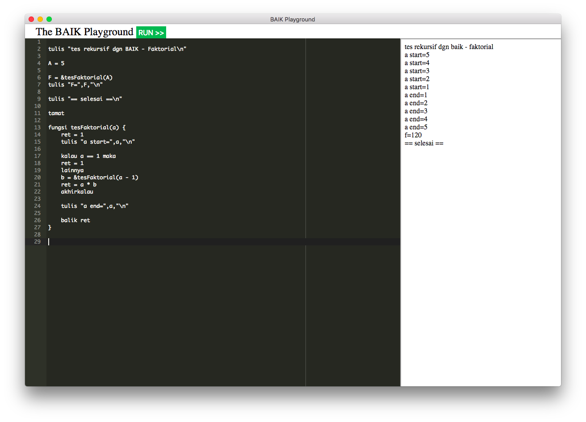

# micro BAIK (µBAIK) lang
µBAIK is a scripting language for IoT, web assembly


## Playground
https://anak10thn.github.io/micro-baik-lang


## Build

```bash
$ make
```

## Install

```bash
$ sudo make install
```

## Web Assembly
```bash
$ baik -w source.ina
```

## µBAIK on Android (termux)
```bash
$ pkg install -y clang make git
$ git clone https://github.com/anak10thn/micro-baik-lang.git
$ cd micro-baik-lang
$ make termux
$ make install
$ baik examples/loop.ina
```
